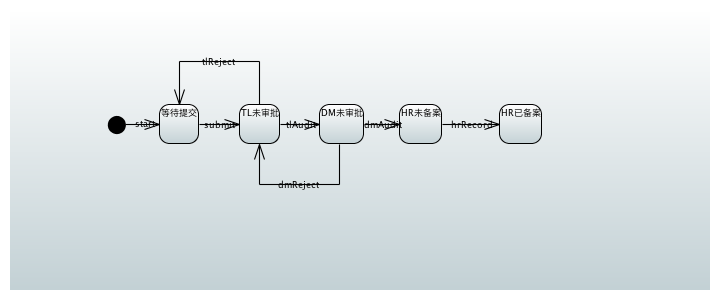
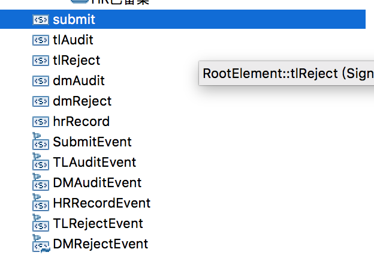

# Spring StateMachine(2) UML状态图支持

还是刚才的以二级审批请假流程为例。

## 绘制流程

首先创建 Papyrus 项目，选择 StateMachine 模板，绘制流程图如下：



然后创建 6 个 signal event 和与之绑定的 signal :



注意，在 Papyrus 图中，除了 State (状态) 和 Transition（迁移）之外，还有 Signal 和 Signal Event 的概念，它们对应于 StateMachine 中的 Event(事件)。其中 Signal 就是事件的名字（字符串常量）。

将 Tansition 和 Signal Event 绑定（设置 trigger）。

## 加载 uml 状态图
将 Papyrus 生成的 uml 文件放到 idea 的 resource 目录。
因为 State、Event 和 Transition 都定义在 UML 中了，所以 States 枚举和 Events 枚举不再需要，状态机的配置也简化了，直接从 UML 文件来加载：

```
@Override
    public void configure(StateMachineModelConfigurer<String, String> model) throws Exception {
        model
                .withModel()
                .factory(modelFactory());
    }

    @Bean
    public StateMachineModelFactory<String, String> modelFactory() {
        // 测试二级审批请假流程
        UmlStateMachineModelFactory factory = new UmlStateMachineModelFactory(
                "classpath:model.uml");
        factory.setStateMachineComponentResolver(stateMachineComponentResolver());
        return factory;
    }
```
注意，这里 States 和 Events 的类型都变成了 String，毕竟在 UML 中不太好定义类型。
如果要注册 Action 或者 Guard，可以通过 Resolver 进行：

```
    @Bean
    public StateMachineComponentResolver<String, String> stateMachineComponentResolver() {
        DefaultStateMachineComponentResolver<String, String> resolver = new DefaultStateMachineComponentResolver<>();
        resolver.registerAction("myAction", myAction());
        resolver.registerGuard("myGuard", myGuard());
        return resolver;
    }

    public Action<String, String> myAction() {
        return new Action<String, String>() {

            @Override
            public void execute(StateContext<String, String> context) {
            }
        };
    }

    public Guard<String, String> myGuard() {
        return new Guard<String, String>() {

            @Override
            public boolean evaluate(StateContext<String, String> context) {
                return false;
            }
        };
    }
```
## 发送事件

跟之前一样，发送事件使用状态机的 sendEvent。只不过 Event 的类型统统是字符串，而且必须在 UML 中定义为 Signal。

```
 private BaseResponse sendEvent(String event,String leaveId){
        BaseResponse result = new BaseResponse();

        if(leaveId == null || leaveId.length()==0){
            result.success = false;
            result.message = "leaveId 不能为空";
            return result;
        }

        try {
            // 根据业务 id 获取状态
            persister.restore(stateMachine,leaveId);

            result.success = stateMachine.sendEvent(event);
            // 持久化状态机
            if (result.success) {
                persister.persist(stateMachine, leaveId);
            }
            JSONObject data = new JSONObject();

            result.message = result.success ? "执行成功":"执行失败";
            result.message = result.message + "，当前状态为："+stateMachine.getState().getId();
            data.put("leaveId",leaveId);
            data.put("event",event);
            data.put("state",stateMachine.getState().getId());
            result.data = data;
        } catch (Exception e) {
            e.printStackTrace();
            result.message = e.getMessage();
        }finally {
            stateMachine.stop();
            return result;
        }
    }
```

## 结论

可以看到，通过 UML 方式绘制状态机，减少了在代码中定义 Event、State 和 Transition 的过程，但 UML 中必须通过额外的元素（Signal和 Signal Event）来定义事件，在目前来说 Spring StateMachine 只支持 Papyrus 绘制的 UML 图。
 
 


